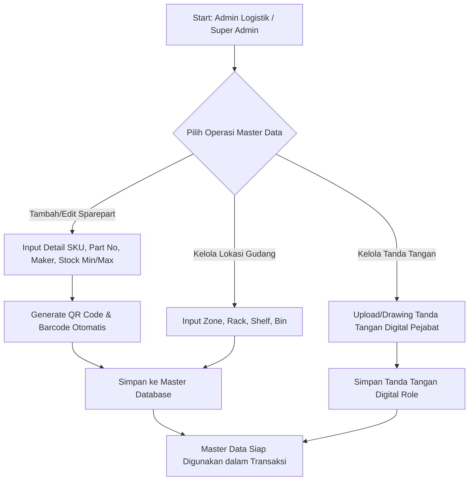
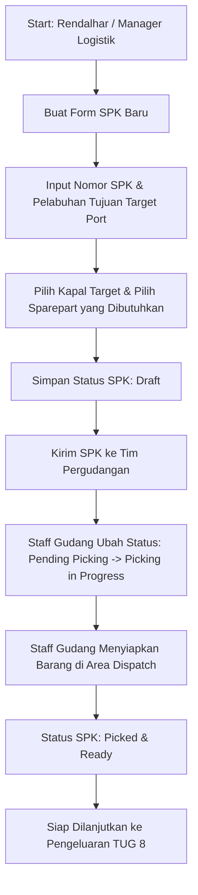
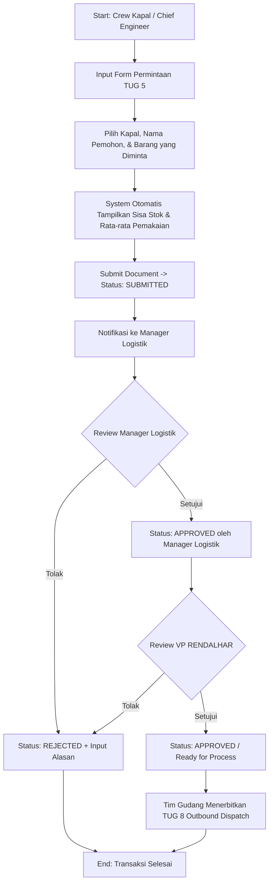
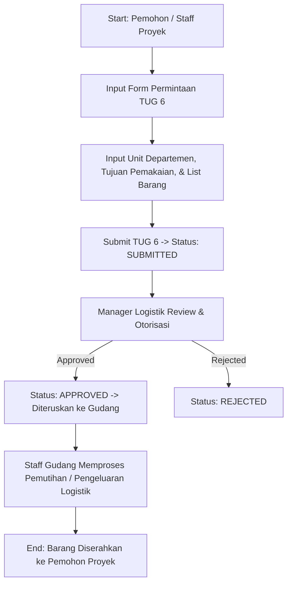
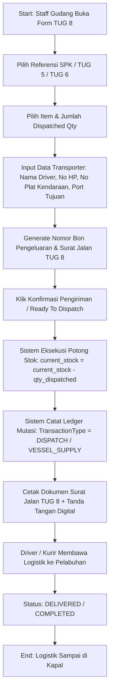
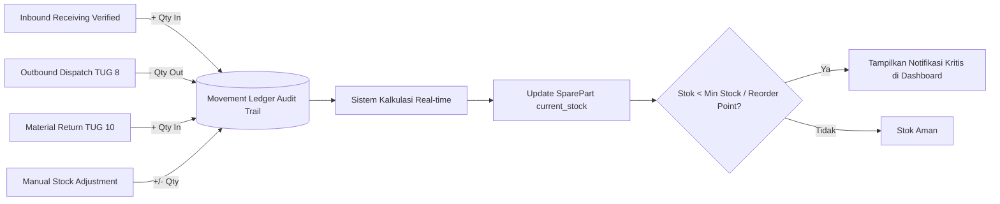
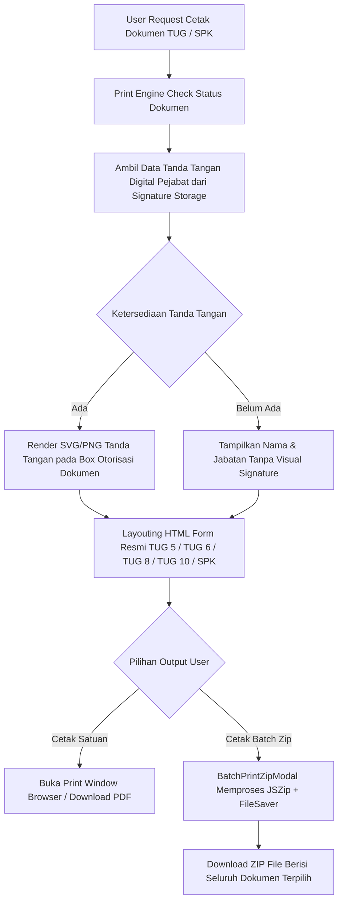

# DOCUMENTASI ANALISIS KODINGAN & BUSINESS PROCESS MAPPING (BPM)
## WMS PT. BAHTERA ADIGUNA (PT. BAG)

---

## BAB 1: OVERVIEW SISTEM & ARSITEKTUR TEKNIS

### 1.1 Deskripsi Sistem
**WMS PT. Bahtera Adiguna (PT. BAG)** adalah aplikasi sistem manajemen pergudangan (*Warehouse Management System*) maritim terintegrasi. Aplikasi ini dirancang khusus untuk mengelola rantai pasok logistik suku cadang (*spare parts*), bahan operasional kapal, pengeluaran logistik pelabuhan, penerimaan vendor, serta pengembalian material kapal dengan mengadopsi standar dokumen operasional **TUG (Tanda Uji/Ukur Gudang)** yaitu **TUG 5, TUG 6, TUG 8, dan TUG 10**.

### 1.2 Tech Stack Utama
1. **Frontend Framework**: React 18 (TypeScript) menggunakan Vite bundler.
2. **Styling & UI**: Vanilla CSS / Custom Modern CSS (`index.css`) dikombinasikan dengan pustaka icon `lucide-react`.
3. **Backend Engine**: Express.js REST API (`server.ts`) yang mendukung arsitektur *dual-mode*:
   - Mode In-Memory State dengan sinkronisasi lokal fallback.
   - Siap terhubung ke Supabase PostgreSQL melalui skema database SQL terstruktur (`supabase-schema.sql`).
4. **Dokumen & PDF Rendering**: 
   - Engine cetak presisi HTML/CSS (`PrintDocument.tsx`).
   - Ekspor batch dokumen ZIP (`zipDocumentGenerator.ts` menggunakan `JSZip` dan `file-saver`).
   - `html2canvas` dan `jspdf` untuk pemrosesan snapshot dokumen.
5. **QR Code & Barcode Engine**: `qrcode` untuk pembuatan QR Code dinamis dan URL halaman publik scan sparepart.

---

### 1.3 Struktur Direktori & Komponen Codebase

```
d:/Dev/wms-pt.-bag/
├── docs/
│   └── ANALISIS_KODINGAN_DAN_BPM_WMS.md   <-- (Dokumen ini)
├── server.ts                             <-- Backend Server Express.js REST API & In-Memory DB
├── supabase-schema.sql                   <-- Skema Tabel Supabase / PostgreSQL Database
├── package.json                          <-- Dependency Management & Scripts
├── index.html                            <-- Entry Point Web HTML
├── src/
│   ├── main.tsx                          <-- Root Mounting Point React App
│   ├── App.tsx                           <-- Main Layout, State Sync, Routing & Authorization Context
│   ├── api.ts                            <-- Client API Service Abstraction & Fallback Data Layer
│   ├── types.ts                          <-- TypeScript Interfaces, Types, Enums Data Model
│   ├── demoSeedData.ts                   <-- Dummy/Seed Data untuk Simulasi Lengkap
│   ├── index.css                         <-- Global Design Tokens, Glassmorphism, & Print CSS Rules
│   ├── utils/
│   │   └── zipDocumentGenerator.ts       <-- Generator Ekspor Dokumen Batch Zip (TUG5, 6, 8, 10, SPK)
│   └── components/
│       ├── Sidebar.tsx                   <-- Menu Navigasi Samping dengan RBAC Filtering
│       ├── Header.tsx                    <-- Bar Atas (Pencarian Global, Profile Simulator, Notifikasi)
│       ├── DashboardView.tsx             <-- Dashboard KPI, Grafik Mutasi, Alert Stok Kritis
│       ├── MasterPartsView.tsx           <-- Pengelolaan Master Spare Part, Barcode & Cetak Label
│       ├── SparePartCatalogView.tsx      <-- Katalog Visual Sparepart & Scan QR Code
│       ├── SPKView.tsx                   <-- Manajemen Surat Perintah Kerja (SPK)
│       ├── MaterialRequestView.tsx       <-- Manajemen Permintaan Barang Operasional Kapal (TUG 5)
│       ├── MaterialRequestTUG6View.tsx   <-- Manajemen Permintaan Barang Non-Kapal / Proyek (TUG 6)
│       ├── DispatchView.tsx              <-- Manajemen Bon Pengeluaran & Surat Jalan (TUG 8)
│       ├── MaterialReturnView.tsx        <-- Manajemen Pengembalian Barang ke Gudang (TUG 10)
│       ├── ReceivingView.tsx             <-- Penerimaan Barang dari Vendor & QC Audit
│       ├── LedgerView.tsx                <-- Buku Besar Mutasi Stok (Audit Trail In/Out)
│       ├── ReportsView.tsx               <-- Laporan Analitis & Ekspor Laporan Excel/CSV/Print
│       ├── BatchPrintZipModal.tsx        <-- Modal Dialog Cetak Batch Zip Dokumen
│       ├── SignatureManagementView.tsx   <-- Manajemen Tanda Tangan Digital Pejabat
│       ├── UsersManagementView.tsx       <-- Pengelolaan User & Role Akses
│       ├── LoginView.tsx                 <-- Halaman Autentikasi Switch Account Simulator
│       └── PrintDocument.tsx             <-- Layout Cetak Dokumen Resmi (TUG 5, 6, 8, 10, SPK, Barcode)
```

---

## BAB 2: DEEP-DIVE STRUKTUR DATA & MODUL KODINGAN

### 2.1 Model Data Utama (`src/types.ts`)

1. **User & UserRole**:
   - Role yang didukung: `Super Admin`, `Warehouse Admin`, `Manager Logistik`, `VP RENDALHAR`, `Superintendent`, `Vessel Crew`.
2. **SparePart**:
   - Atribut kunci: `sku`, `part_number`, `part_name`, `alternative_part_number`, `category`, `vendor_id`, `vessel_compatibility`, `unit`, `brand`, `maker`, `minimum_stock`, `maximum_stock`, `reorder_point`, `current_stock`, `reserved_stock`, `location_id`, `barcode`, `qr_code`, `qr_slug`, `qr_url`.
3. **SPKWorkOrder (Surat Perintah Kerja)**:
   - Atribut kunci: `spk_number`, `target_port`, `vessels` (array berisi `vessel_name` dan `items`), `status` (`Draft`, `Pending Picking`, `Picking in Progress`, `Picked & Ready`, `Dispatched`, `Incomplete`).
4. **MaterialRequest (TUG 5 & TUG 6)**:
   - Document Type: `TUG5` (Operasional Kapal) atau `TUG6` (Proyek / Non-Kapal).
   - Items: `spare_part_id`, `part_number`, `avg_monthly_usage`, `remaining_stock`, `requested_qty`, `approved_qty`, `unit_price`, `item_status`.
   - Workflow Status: `Draft` -> `Submitted` -> `Approved` -> `Rejected` -> `Processed`.
5. **OutboundDispatch (TUG 8)**:
   - Document Type: Bon Pengeluaran & Surat Jalan Logistik Outbound.
   - Atribut pengiriman: `tug8_number`, `surat_jalan_number`, `bon_pengeluaran_number`, `vehicle_number`, `driver_name`, `driver_phone`, `destination_port`, `consignee`, `spk_id`, `work_order_ref`.
   - Workflow Status: `Draft` -> `Ready To Dispatch` -> `In Transit` / `Dispatched` -> `Delivered` / `Completed`.
6. **MaterialReturn (TUG 10)**:
   - Document Type: Pengembalian Material Kapal ke Gudang.
   - Workflow Status: `Draft` -> `Submitted` -> `Pending Verification` -> `Approved` / `Rejected` -> `Completed`.
7. **MovementLedgerEntry**:
   - Catatan histori mutasi stok: `transaction_type` (`RECEIVING`, `DISPATCH`, `VESSEL_CONSUMPTION`, `STOCK_ADJUSTMENT`, `LOCATION_TRANSFER`, `RETURN`), `qty_in`, `qty_out`, `before_stock`, `after_stock`, `reference_number`, `transaction_date`, `created_by`.
8. **DigitalSignature**:
   - Penyiapan tanda tangan digital berbasis Role (`Manager Logistik`, `VP RENDALHAR`, `Kepala Gudang`, `Captain`, `Petugas Gudang`).

---

### 2.2 Penjelasan Detail Komponen Utama UI

#### A. `App.tsx` & `api.ts`
- **Fungsi**: Bertindak sebagai *State Engine* pusat dan *Hydration Manager*. `App.tsx` memuat data master dan transaksi secara paralel saat boot (`bootApp()`) dan mengelola tab navigasi aktif.
- **Role Switching**: Menyediakan *Simulator Switcher* di header untuk berganti role secara instan (Super Admin vs Manager Logistik vs VP RENDALHAR vs Staff Gudang vs Vessel Crew) tanpa perlu logout berulang kali saat pengujian.

#### B. `DashboardView.tsx`
- **Fungsi**: Menampilkan KPI operasional pergudangan secara visual:
  - Jumlah SKU Aktif, Total Nilai Inventaris (Rp), TUG 5/6 Pending Approval, TUG 8 Pending Dispatch, dan TUG 10 Pending Return.
  - Grafik Batang / Area untuk tren mutasi bulanan (Inbound vs Outbound).
  - Peringatan Otomatis (*Critical Alerts*) untuk sparepart yang stoknya di bawah `minimum_stock` atau `reorder_point`.

#### C. `MasterPartsView.tsx` & `SparePartCatalogView.tsx`
- **Fungsi**: Pengelolaan master catalog suku cadang.
  - CRUD Sparepart: SKU, Nomor Part, Pembuat (*Maker*), Brand, Kompatibilitas Kapal, Rak/Bin Gudang.
  - Pencetakan Barcode & QR Code individual maupun batch label barang.
  - QR Code Scanner terintegrasi kamera/file upload untuk pencarian cepat lokasi dan detail part.

#### D. `SPKView.tsx` (Surat Perintah Kerja)
- **Fungsi**: Mengelompokkan kebutuhan suku cadang untuk beberapa kapal dalam 1 wilayah/pelabuhan tujuan (*Target Port*).
  - SPK mengikat daftar material yang akan diproses oleh tim pergudangan menjadi pengiriman gabungan.

#### E. `MaterialRequestView.tsx` (TUG 5) & `MaterialRequestTUG6View.tsx` (TUG 6)
- **Fungsi**: Form dan tabel manajemen Nota Permintaan Barang.
  - **TUG 5**: Permintaan dari kapal/crew untuk operasional armada kapal.
  - **TUG 6**: Permintaan barang untuk unit proyek, kantor, atau keperluan operasional non-kapal.
  - Alur otorisasi multi-level: Pengajuan oleh Crew/Staff -> Persetujuan Manager Logistik -> Persetujuan VP RENDALHAR.

#### F. `DispatchView.tsx` (TUG 8)
- **Fungsi**: Eksekusi pengeluaran barang gudang (*Outbound Dispatch*).
  - Menghubungkan pengiriman dengan referensi SPK atau Nota TUG 5 / TUG 6.
  - Menginput data pengirim (*Transporter/Driver*), plat nomor armada, dan nomor surat jalan.
  - **Eksekusi Dispatch**: Saat dikonfirmasi (`Ready To Dispatch` / `Dispatched`), sistem secara otomatis **memotong stok barang** (`current_stock`) di database dan mencatat transaksi ke **Movement Ledger**.

#### G. `MaterialReturnView.tsx` (TUG 10)
- **Fungsi**: Form pengembalian material yang tidak terpakai atau material copotan/bekas dari kapal kembali ke gudang.
  - Saat diajukan, status berada pada `Pending Verification`.
  - Saat diverifikasi dan disetujui oleh Petugas Gudang / Manager Logistik, sistem secara otomatis **menambahkan stok barang** kembali ke inventaris gudang dan mencatat mutasi `qty_in` pada Movement Ledger.

#### H. `ReceivingView.tsx` (Inbound Receiving)
- **Fungsi**: Penerimaan barang datang dari Vendor berdasarkan Purchase Order (PO) / Delivery Note (DN).
  - Dilengkapi fitur Quality Control (QC) per item: `Verified`, `Partial Reject`, `Full Reject`.
  - Penambahan stok otomatis saat status dikonfirmasi `Verified` / `Accepted`.

#### I. `LedgerView.tsx`
- **Fungsi**: Audit trail lengkap seluruh pergerakan barang. Menghindari selisih fisik gudang dengan riwayat stok *Before* dan *After* serta nomor referensi dokumen yang valid.

#### J. `SignatureManagementView.tsx` & `PrintDocument.tsx`
- **Fungsi**: Pengelolaan tanda tangan digital pejabat resmi dan layout cetak standar PT. BAG.
  - Tanda tangan digital otomatis disematkan pada dokumen TUG 5, TUG 6, TUG 8, TUG 10, dan SPK sesuai status otorisasi.
  - Rendering cetak mendukung mode preview, cetak langsung via browser window, dan ekspor ZIP massal via `BatchPrintZipModal.tsx`.

---

## BAB 3: BUSINESS PROCESS MAPPING (BPM) DETIL DENGAN MERMAID

### BPM 1: Master Data Management (Spare Parts & Lokasi Gudang)
Proses pengelolaan data induk barang, vendor, lokasi penyimpanan (Zone, Rack, Shelf, Bin), dan tanda tangan digital.



---

### BPM 2: Inbound Receiving & QC Vendor (Penerimaan Barang datang dari Vendor)
Proses penerimaan logistik suku cadang yang dibeli dari supplier/vendor.

```mermaid
flowchart TD
    A[Start: Vendor Mengirim Barang ke Gudang] --> B[Staff Gudang Buka Form Receiving]
    B --> C[Input No. PO, No. Surat Jalan Vendor, & Vendor Name]
    C --> D[Pemeriksaan Fisik & Quality Control QC]
    D --> E{Apakah Barang Sesuai Specs & Baik?}
    E -->|Sesuai / Pass| F[Set QC Status: Verified / Accepted]
    E -->|Cacat / Kurang| G[Set QC Status: Partial / Full Reject + Input Alasan]
    F --> H[Konfirmasi Inbound Receiving]
    G --> H
    H --> I[Sistem Update Current Stock Sparepart (+ Qty Received)]
    I --> J[Sistem Catat Movement Ledger Type: RECEIVING]
    J --> K[End: Barang Siap di Rak Gudang]
```

---

### BPM 3: Alur SPK Work Order (Surat Perintah Kerja Operasional Armada)
Proses pembuatan paket kerja perbaikan kapal dan kebutuhan logistik per pelabuhan.



---

### BPM 4: Alur Material Request TUG 5 (Permintaan Barang Operasional Kapal)
Proses pengajuan suku cadang oleh Crew Kapal / Operational Staff hingga persetujuan pejabat.



---

### BPM 5: Alur Material Request TUG 6 (Permintaan Barang Proyek / Non-Kapal)
Proses pengajuan logistik barang/bahan untuk keperluan operasional kantor, proyek khusus, atau non-kapal.



---

### BPM 6: Alur Outbound Dispatch TUG 8 (Bon Pengeluaran & Surat Jalan)
Proses pengeluaran barang fisik dari gudang, pembuatan surat jalan, pemotongan stok otomatis, dan pencatatan audit ledger.



---

### BPM 7: Alur Material Return TUG 10 (Pengembalian Barang Sisa / Copotan ke Gudang)
Proses pengembalian suku cadang tidak terpakai atau bekas penggantian dari kapal kembali ke gudang fisik.

```mermaid
flowchart TD
    A[Start: Crew Kapal / Staff Gudang Pelabuhan] --> B[Buat Form Pengembalian TUG 10]
    B --> C[Pilih Nama Kapal, Referensi SPK/TUG8, & Alasan Pengembalian]
    C --> D[Input List Barang & Qty Return]
    D --> E[Submit TUG 10 -> Status: SUBMITTED / PENDING VERIFICATION]
    E --> F[Petugas Gudang Melakukan Verifikasi Fisik Barang]
    F --> G{Apakah Fisik Barang Valid?}
    G -->|Tolak| H[Status: REJECTED + Alasan Penolakan]
    G -->|Setujui| I[Set Status: APPROVED / COMPLETED]
    I --> J[Sistem Eksekusi Tambah Stok: current_stock = current_stock + qty_returned]
    J --> K[Sistem Catat Ledger Mutasi: TransactionType = RETURN (Qty In)]
    K --> L[Cetak Dokumen TUG 10 + Tanda Tangan Digital Petugas Gudang]
    H --> M[End: Transaksi Selesai]
    L --> M
```

---

### BPM 8: Alur Stock Ledger & Audit Trail (Integrasi Mutasi Real-Time)
Setiap transaksi di WMS yang mengubah jumlah stok fisik secara otomatis dipandu oleh skema audit ledger berikut:



---

### BPM 9: Otorisasi Tanda Tangan Digital & Batch Zip Export
Mesin cetak dokumen dan pengesahan digital otomatis pada lembar fisik TUG.



---

## BAB 4: MATRIX HAK AKSES ROLE (RBAC MATRIX)

| Modul / Form | Super Admin | Warehouse Admin | Manager Logistik | VP RENDALHAR | Superintendent | Vessel Crew |
| :--- | :---: | :---: | :---: | :---: | :---: | :---: |
| **Dashboard KPI & Analytics** | Full Access | Full Access | Full Access | Full Access | View Only | View Only |
| **Master Spare Parts (CRUD)** | Full Access | Full Access | View / Edit | View Only | View Only | View Only |
| **Barcode & QR Code Printing** | Full Access | Full Access | View & Print | View & Print | Read | Read |
| **SPK Work Orders** | Full Access | Process Picking | Approval & Create | Approval & Create | View Only | View Only |
| **Material Request TUG 5** | Full Access | Process Outbound | Approve / Reject | Final Approval | View / Request | Create Request |
| **Material Request TUG 6** | Full Access | Process Outbound | Approve / Reject | Final Approval | Create Request | Create Request |
| **Outbound Dispatch TUG 8** | Full Access | Create & Dispatch | Approval & Review | Review | View Only | View Only |
| **Material Return TUG 10** | Full Access | Verify & Approve | Review | Review | Create Return | Create Return |
| **Inbound Receiving Vendor** | Full Access | Full Access & QC | Review | Review | No Access | No Access |
| **Movement Ledger Audit** | Full Access | View Only | View Only | View Only | View Only | View Only |
| **Digital Signature Mgmt** | Full Access | Own Signature | Own Signature | Own Signature | Own Signature | Own Signature |
| **User & Role Management** | Full Access | No Access | No Access | No Access | No Access | No Access |

---

## BAB 5: KESIMPULAN & REKOMENDASI PENGEMBANGAN FUTURE-READY

1. **Kelengkapan Fitur Operasional Gudang Maritim**:
   Sistem WMS PT. Bahtera Adiguna telah mencakup seluruh rantai proses bisnis logistik maritim, mulai dari inventarisasi suku cadang, permintaan kebutuhan kapal (TUG 5 & TUG 6), konsolidasi SPK pelabuhan, bon pengeluaran logistik (TUG 8), penerimaan vendor, hingga pengembalian sisa material (TUG 10).
2. **Kepatuhan Audit & Akuntabilitas**:
   Setiap transaksi dikorelasikan langsung dengan **Movement Ledger** dan dilengkapi **Otorisasi Tanda Tangan Digital** multi-pejabat (Manager Logistik, VP RENDALHAR, Kepala Gudang, Captain), menjamin akuntabilitas stok fisik dan nilai inventaris.
3. **Rekomendasi Integrasi Lanjutan**:
   - Menghubungkan API backend `server.ts` secara persisten ke Supabase cloud instance dengan mengaplikasikan file DDL `supabase-schema.sql` yang sudah tersedia.
   - Mengaktifkan fitur push notification (WebSocket/PWA) untuk alert persetujuan TUG 5/6 real-time bagi Manager Logistik dan VP RENDALHAR.
